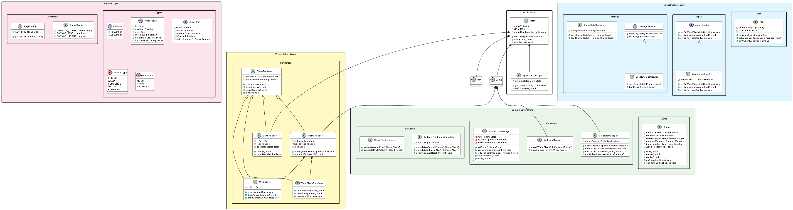
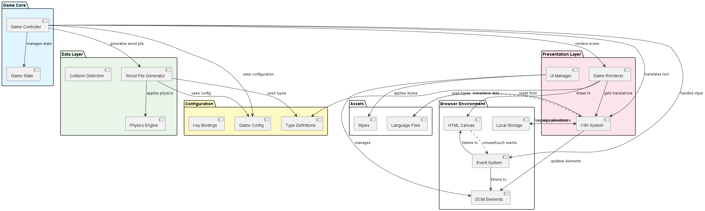
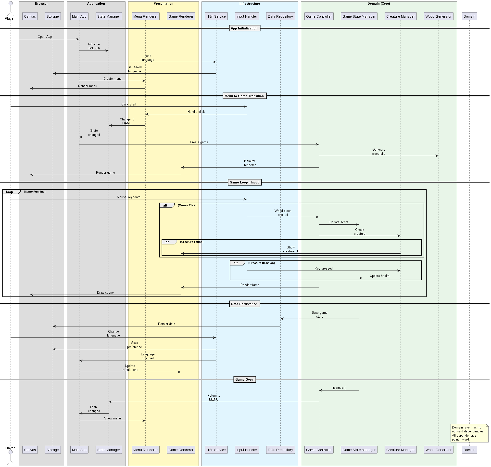

# Within the Woodpile - Arkitektur

Detta dokument beskriver systemarkitekturen för Within the Woodpile-spelet.

## UML-diagram

### Klassdiagram

- Visar alla klasser och deras relationer
- Källa: [class-diagram.puml](architecture/class-diagram.puml)

### Komponentdiagram  

- Visar systemets moduler och beroenden
- Källa: [component-diagram.puml](architecture/component-diagram.puml)

### Dataflödesdiagram

- Visar hur data flödar genom systemet
- Källa: [dataflow-diagram.puml](architecture/dataflow-diagram.puml)

## Arkitekturprinciper

Projektet följer clean code-principer:
- **Separation of Concerns**: Logik, rendering och i18n separerat
- **Dependency Injection**: Klasser tar emot beroenden via konstruktor  
- **Single Responsibility**: Varje klass har ett tydligt ansvar
- **Type Safety**: Fullständig TypeScript-typning