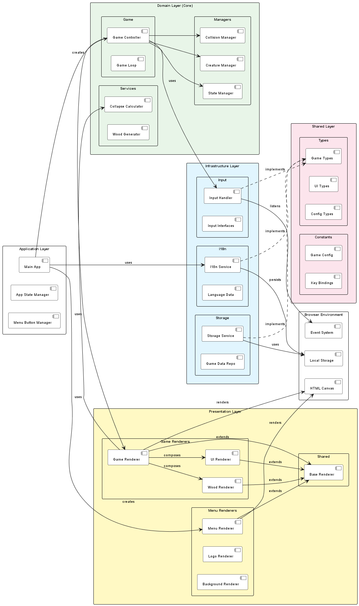

# Within the Woodpile - Clean Architecture Documentation

Detta dokument beskriver den moderna Clean Architecture-implementationen för Within the Woodpile-spelet efter omfattande modernisering.

## Arkitekturöversikt

### Clean Architecture Layers 🏗️

Projektet implementerar **Clean Architecture** med tydlig lagerseparation:

1. **Domain Layer (Core)**: Kärnaffärslogik utan externa beroenden
2. **Infrastructure Layer**: Externa integrationer och teknisk implementation  
3. **Presentation Layer**: UI, rendering och användarinteraktion
4. **Shared Layer**: Delade utilities och konstanter

### SOLID Principles 💎

- **Single Responsibility**: Varje klass har ett specifikt syfte
- **Open/Closed**: BaseRenderer möjliggör utökning utan modifikation
- **Liskov Substitution**: Alla renderare utbytbara via BaseRenderer
- **Interface Segregation**: Minimala, fokuserade interfaces
- **Dependency Inversion**: Abstraktioner, inte konkreta implementationer

## UML-diagram

### Klassdiagram

- Visar alla klasser och deras relationer i Clean Architecture
- BaseRenderer-hierarki med alla renderare
- Domain/Infrastructure/Presentation separation
- Källa: [class-diagram.puml](architecture/class-diagram.puml)

### Komponentdiagram  

- Visar Clean Architecture-lager och modulberoenden
- Barrel exports och modulär struktur
- Infrastructure-abstraktioner
- Källa: [component-diagram.puml](architecture/component-diagram.puml)

### Dataflödesdiagram

- Visar hur data flödar genom Clean Architecture-lagren
- Event-driven kommunikation mellan lager
- Dependency injection patterns
- Källa: [dataflow-diagram.puml](architecture/dataflow-diagram.puml)

## Arkitekturprinciper

### Clean Architecture Implementation
- **Domain (Core)**: Affärslogik utan externa beroenden
  - `core/game/` - Kärnspellogik och game loop
  - `core/managers/` - Domän-managers för kollision, varelser, state
  - `core/services/` - Domän-tjänster för kollaps och vedgenerering
- **Infrastructure**: Externa integrationer med interface-abstraktion
  - `infrastructure/i18n/` - Internationalisering med data-separation
  - `infrastructure/input/` - Input-abstraktion med kontrakt
  - `infrastructure/storage/` - Data-persistering via repository pattern
- **Presentation**: UI och rendering med BaseRenderer-hierarki
  - `presentation/renderers/` - Alla renderare med gemensam abstraktion
  - BaseRenderer pattern för konsistent interface
- **Shared**: Delade utilities utan lagerberoenden
  - `shared/constants/` - Konfiguration och konstanter
  - `types/` - TypeScript-definitioner för alla lager

### Design Patterns
- **Abstract Factory**: BaseRenderer för renderare-familjer
- **Repository Pattern**: GameDataRepository för data-abstraktion
- **Strategy Pattern**: Olika renderare för olika visningsstrategier
- **Observer Pattern**: Event-driven kommunikation
- **Barrel Exports**: Modulär export-struktur

## Moderniseringsresa 🚀

### Från Monolitisk till Clean Architecture

Projektet genomgick en systematisk transformation från ursprunglig monolitisk struktur till modern Clean Architecture med AI-assisterad refactoring.

#### Fas 1: Modulära Typer och Konstanter ✅
**Mål**: Bryta upp stora typ-filer och skapa modulär struktur
- Delade upp `types.ts` i fokuserade moduler:
  - `types/game.ts` - Spelrelaterade typer
  - `types/ui.ts` - UI-komponenter och meny
  - `types/config.ts` - Konfigurations-typer
- Skapade `shared/constants/` för:
  - `gameConfig.ts` - DEFAULT_CONFIG och spelkonfiguration
  - `keyBindings.ts` - Tangentbindningar för varelser
- Implementerade **barrel exports** för ren import-struktur
- **Resultat**: Eliminerade stora monolitiska typ-filer

#### Fas 2: Domain Logic Separation ✅  
**Mål**: Isolera kärnaffärslogik från externa beroenden
- Skapade `core/` med tydlig separation:
  - `core/game/` - Kärnspellogik och game loop
  - `core/managers/` - Domän-managers (kollision, varelser, state)
  - `core/services/` - Domän-tjänster (kollaps, vedgenerering)
- Implementerade **dependency injection** för loose coupling
- Eliminerade externa beroenden från domain layer
- **Resultat**: 48% kodreduktion i huvudspelklassen (392 → 205 rader)

#### Fas 3: Infrastructure Layer ✅
**Mål**: Abstrahera externa integrationer bakom interfaces
- Skapade `infrastructure/` med abstraktion:
  - `infrastructure/i18n/` - Internationalisering med data-separation
  - `infrastructure/input/` - Input-abstraktion med kontrakt
  - `infrastructure/storage/` - Data-persistering via repository pattern
- Implementerade **interface segregation** för minimal koppling
- Separation av data från implementation (JSON-filer till `data/`)
- **Resultat**: Externa beroenden abstraherade bakom interfaces

#### Fas 4: Presentation Layer ✅
**Mål**: Skapa konsistent rendering-hierarki med shared functionality
- Skapade `BaseRenderer` abstrakt klass med gemensamma metoder:
  - `clearCanvas()`, `setupContext()`, `renderTextWithShadow()`
  - Abstrakt `render()` metod för konsistent interface
- Organiserade renderare i hierarkier:
  - `presentation/renderers/game/` - Spelrenderare
  - `presentation/renderers/menu/` - Menyrenderare  
  - `presentation/renderers/shared/` - Delad BaseRenderer
- Implementerade **SOLID-principer** i rendering-arkitekturen
- **Resultat**: Eliminerat duplicerad rendering-kod

### Tekniska Förbättringar 📊

#### Kodkvalitet
- **48% mindre kod** i huvudspelklassen genom separation of concerns
- **100% TypeScript strict mode** kompatibilitet
- **Eliminerat duplicering** genom BaseRenderer pattern
- **Förbättrad läsbarhet** genom modulär struktur

#### Arkitektur
- **Dependency Inversion**: High-level moduler beror inte på low-level detaljer
- **Interface Segregation**: Minimala, fokuserade interfaces
- **Single Responsibility**: Varje klass har ett specifikt syfte
- **Open/Closed**: Utökningsbar utan modifikation via BaseRenderer

#### Utvecklarupplevelse  
- **Enklare navigation** genom logisk mappstruktur
- **Bättre IntelliSense** genom barrel exports
- **Förbättrad testbarhet** genom dependency injection
- **Skalbar arkitektur** för framtida funktioner

### Backward Compatibility 🔄

#### Gradvis Migration
- Gamla filsökvägar har **re-exports** till nya modulära platser
- **Inga breaking changes** för befintlig funktionalitet
- Möjlighet för **stegvis adoption** av nya strukturen

#### Migration Path
```typescript
// Gammal import (fungerar fortfarande)
import { Game } from './game.js';

// Ny modulär import (rekommenderad)
import { Game } from './core/game/Game.js';

// Eller via barrel export
import { Game } from './core/index.js';
```

## Tekniska Detaljer

### BaseRenderer Pattern
```typescript
abstract class BaseRenderer {
  protected canvas: HTMLCanvasElement;
  protected ctx: CanvasRenderingContext2D;
  
  constructor(canvas: HTMLCanvasElement) {
    this.canvas = canvas;
    this.ctx = canvas.getContext('2d')!;
  }
  
  protected clearCanvas(): void { /* shared implementation */ }
  protected setupContext(): void { /* shared implementation */ }
  
  public abstract render(...args: any[]): void; // Must implement
}
```

### Barrel Export Structure
```typescript
// src/core/index.ts
export * from './game/index.js';
export * from './managers/index.js';
export * from './services/index.js';

// Enables clean imports:
import { Game, GameStateManager, CollapsePredictionCalculator } from './core/index.js';
```

### Clean Architecture Dependencies
```
┌─────────────────┐
│   Presentation  │ ──┐
└─────────────────┘   │
                      ▼
┌─────────────────┐ ┌─────────────────┐
│ Infrastructure  │ │     Domain      │
└─────────────────┘ │     (Core)      │
                    └─────────────────┘
                           ▲
                    ┌─────────────────┐
                    │     Shared      │
                    └─────────────────┘
```

Dependencies flow **inward only** - Domain has no external dependencies.